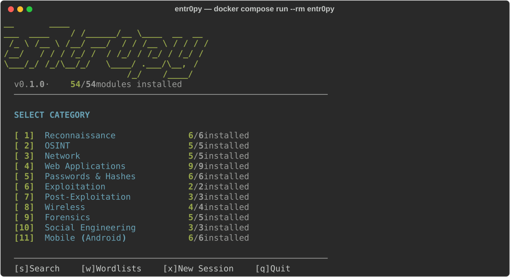

<h1 align="center">entr0py</h1>

<p align="center"><b>A modular, containerized penetration-testing framework.</b></p>

<p align="center">
  <a href="https://github.com/DNRosacena/entr0py/actions/workflows/ci.yml"></a>
  
  
  
  
  
</p>

entr0py is a **meta-framework**: rather than reimplementing security tools, it orchestrates
**54 battle-tested open-source tools** behind one consistent interface — an interactive TUI and
a scriptable CLI — packaged into a single reproducible **Kali-based Docker image**. Point it at a
target, pick a tool, get streamed output. Reconnaissance through post-exploitation, plus Android
app analysis.

Inspired by [fsociety](https://github.com/Manisso/fsociety), rebuilt around a clean module API,
session/scope management, and a portable container so it runs the same everywhere.

<p align="center"></p>

---

## Contents

- [⚠️ Authorized use only](#️-authorized-use-only)
- [Quick start](#quick-start)
- [Example workflow](#example-workflow)
- [Toolbox](#toolbox--54-modules-across-11-categories)
- [CLI reference](#cli-reference)
- [Architecture](#architecture)
- [Adding a module](#adding-a-module)
- [Local install (without Docker)](#local-install-without-docker)
- [Notes & limitations](#notes--limitations)
- [License](#license)

---

## ⚠️ Authorized use only

entr0py is for **authorized security testing and education only**. Use it exclusively against
systems, applications, and devices that **you own or have explicit written permission to test**.

Unauthorized scanning, exploitation, credential attacks, or payload deployment is **illegal** in
most jurisdictions. The exploitation and payload modules (`metasploit`, `android_payload`,
`drozer`, …) can cause real harm — **you are solely responsible for how you use them**, and the
authors assume no liability for misuse.

## Quick start

```bash
git clone git@github.com:DNRosacena/entr0py.git
cd entr0py
docker compose build                      # builds the Kali-based image (first build is large)
docker compose run --rm entr0py           # launch the interactive TUI
```

Headless / scripted:

```bash
docker compose run --rm entr0py list                    # list all modules
docker compose run --rm entr0py search nmap             # search modules
docker compose run --rm entr0py run subfinder domain=example.com
docker compose run --rm entr0py run nuclei target=https://example.com severity=high,critical
```

> The compose service runs with `network_mode: host` and the `NET_ADMIN` / `NET_RAW`
> capabilities so raw-socket and wireless tools (nmap, masscan, bettercap, aircrack, …) work.
> Reports persist to `./data/reports/` on the host.

## Example workflow

A small recon → scan chain against a scoped target:

```bash
# 1. Discover subdomains (passive), then find which are live
docker compose run --rm entr0py run subfinder domain=example.com all=true
docker compose run --rm entr0py run httpx target=https://example.com tech=true title=true

# 2. Fingerprint + check for a WAF
docker compose run --rm entr0py run whatweb target=https://example.com
docker compose run --rm entr0py run wafw00f url=https://example.com

# 3. Vulnerability scan (rate-limited to stay gentle on production)
docker compose run --rm entr0py run nuclei target=https://example.com severity=medium,high,critical

# 4. Analyze an Android APK you own
docker compose run --rm -v "$PWD":/work entr0py run apkleaks apk=/work/app.apk
```

## Playbooks (workflow chaining)

Playbooks chain modules into a pipeline, feeding each stage's parsed output into the
next — so recon → probe → scan runs as one command instead of three manual copy-pastes:

```bash
docker compose run --rm entr0py playbook list
docker compose run --rm entr0py playbook run recon target=example.com
```

The bundled `recon` playbook runs **`subfinder → httpx → nuclei`**: subfinder's discovered
subdomains are piped into httpx (which keeps the live ones), and those live URLs are handed
to nuclei to scan. Playbooks are declarative TOML (`entr0py/playbooks/*.toml`); each stage
names a `module`, its `options` (with `{var}` placeholders filled from the CLI), and an
optional `feed` — the option that receives the previous stage's artifacts:

```toml
[[stage]]
module  = "subfinder"
options = { domain = "{target}", all = "true" }

[[stage]]
module  = "httpx"
feed    = "input"          # subfinder's hosts → httpx -l <file>
options = { silent = "true" }
```

Modules expose their feed-forward artifacts via a `parse()` method (subfinder → hostnames,
httpx → live URLs). Add a new playbook by dropping a `.toml` in `entr0py/playbooks/`.

## Sessions & reports

Runs can be grouped into a **session**, and a session rolls up into a single
**Markdown / HTML / JSON report** — a shareable deliverable, not just scrollback. Each
module's `parse()` feeds the report's structured findings (subfinder → hostnames, httpx →
live URLs, nuclei → matches).

```bash
docker compose run --rm entr0py session new engagement --scope example.com   # → session #1
docker compose run --rm entr0py run subfinder domain=example.com --session 1
docker compose run --rm entr0py run nuclei target=https://example.com --session 1
docker compose run --rm entr0py report --session 1 --fmt md     # → data/reports/session_1.md
```

Playbook runs create a session automatically and print the `report --session N` command to
finish with a deliverable.

## Toolbox — 54 modules across 11 categories

| Category | # | Tools |
|---|---|---|
| Reconnaissance | 6 | subfinder, amass, httpx, dnsx, katana, theHarvester |
| OSINT | 5 | sherlock, maigret, holehe, s3scanner, phoneinfoga |
| Network | 5 | nmap, masscan, rustscan, netdiscover, bettercap |
| Web Applications | 9 | nuclei, sqlmap, nikto, ffuf, dalfox, arjun, wafw00f, whatweb, corsy |
| Passwords & Hashes | 6 | hashcat, john, hydra, crunch, cewl, cupp |
| Exploitation | 2 | metasploit, searchsploit |
| Post-Exploitation | 3 | linpeas, pspy, traitor |
| Wireless | 4 | aircrack-ng, wifite, hcxdumptool, kismet |
| Forensics | 5 | binwalk, foremost, exiftool, stegseek, volatility3 |
| Social Engineering | 3 | setoolkit, gophish, evilginx2 |
| Mobile (Android) | 6 | apktool, jadx, dex2jar, apkleaks, android_payload, drozer |

## CLI reference

```
entr0py                          Launch the interactive TUI
entr0py list [--category X]      List modules (optionally by category)
entr0py search <query>           Search modules by name / tag / description
entr0py run <slug> [k=v …]       Run a module headlessly (key=value options)
entr0py playbook list            List multi-stage tool chains (playbooks)
entr0py playbook run <name> k=v  Run a playbook (e.g. playbook run recon target=…)
entr0py install <slug>           Install a module's dependencies (non-Docker hosts)
entr0py scope add <target>       Add a target to the active scope
entr0py session new <name>       Create a scan session (add runs with --session N)
entr0py wordlists                Manage / download wordlists
entr0py report --session <id>    Roll a whole session into a md/html/json report
entr0py report <file> [--fmt]    Report from a single saved output file
```

Every module lists its own options — run it with no required value to see them, or check the
module file under `entr0py/modules/<category>/`.

## Architecture

```
entr0py/
├── core/                 module base classes, registry, executor, scope/session, installer, paths
├── modules/<category>/   one file per tool — a Module subclass + metadata + async run()
├── ui/menu.py            Rich / pyfiglet interactive terminal menu
└── __main__.py           Typer CLI entry point
Dockerfile                Kali base; toolchain in per-tool cached layers + retry-on-flaky-network
docker-compose.yml        host networking + NET_ADMIN/NET_RAW caps + report volume
```

Each tool is a `Module` subclass declaring the binaries/packages it needs and an async `run()`
that streams output line-by-line. The registry auto-discovers modules on import.

## Adding a module

Drop a file into the right category package and register it — that's it:

```python
# entr0py/modules/web/mytool.py
from typing import Any, AsyncIterator
from entr0py.core.base import Category, Module, ModuleMeta, Option

class MyTool(Module):
    meta = ModuleMeta(
        name="MyTool", slug="mytool",
        description="What it does.",
        category=Category.WEB, author="you", version="1.0",
        tools=["mytool"],                 # binary that must be on PATH
    )
    def options(self) -> list[Option]:
        return [Option("target", "-u", "Target URL")]
    async def run(self, opts: dict[str, Any]) -> AsyncIterator[str]:
        async for line in self._exec(["mytool", "-u", opts["target"]]):
            yield line
```

Add `MyTool()` to that category's `__init__.py` `ALL` list, add the install source to
`core/installer.py`, and (for the container) an install step in the `Dockerfile`.

## Local install (without Docker)

Requires Python 3.11+. Tools are installed on demand:

```bash
pip install -e .
entr0py install <slug>     # fetches that tool via apt / go / cargo / gem / pip / release
```

The container is the supported path — it guarantees every tool is present and pinned. A local
install depends on your OS package manager and toolchains.

## Notes & limitations

- **mimikatz is intentionally excluded** — a native Windows tool with no Linux build; it can't
  run in this container. Use it on a Windows host, or load it remotely via Metasploit.
- **Android dynamic instrumentation** (frida / objection) isn't bundled — it needs a device or
  emulator. The mobile modules cover static analysis, payload generation, and `drozer` (which
  connects to a device agent over `adb`).
- Raw-socket / wireless tools require the compose file's `NET_ADMIN` / `NET_RAW` capabilities and
  fail under a bare `docker run` without them.

## License

MIT. The bundled third-party tools retain their own respective licenses.
